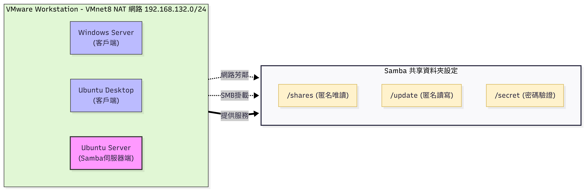

# Samba Server 多重權限共享環境建置實驗

本專案紀錄於 VMware Workstation 環境下，使用 Ubuntu Server 24.04 架設 Samba (SMB) 伺服器，並針對 Windows 與 Linux 兩款不同的客戶端（Client）進行三種不同權限情境的網路共享驗證。

## 實驗環境拓撲

本實驗所有虛擬機均連接至 VMware 的 **VMnet8 (NAT 模式)** 虛擬交換機，網段為 `192.168.132.0/24`。

- **Samba 伺服器端**：Ubuntu Server 24.04.4 Live Server
- **Windows 客戶端**：Windows Server 2016
- **Linux 客戶端**：Ubuntu Desktop 24.04.4 Desktop

